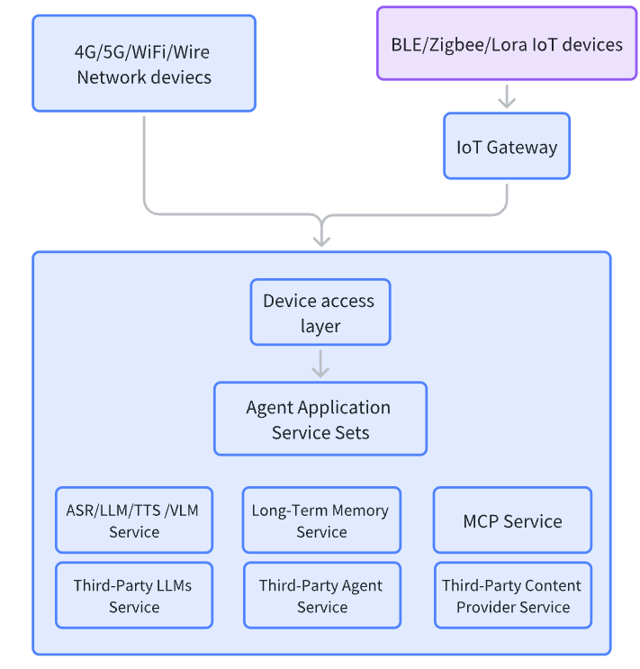

 # **欢迎来到 Next-Big-Seek Agent OS!**

（[English](README.md)| 中文）

---
## ✨介绍

**Next-Big-Seek-Agent OS：新一代互联智能应用核心中枢**

这款多模态智能体操作系统无缝接入、理解并处理来自庞大终端设备生态系统的数据——从智能手机、智能音箱到AI玩具，以及通过WiFi、蓝牙、Zigbee、LoRa和4G/5G网络通信的各类物联网传感器，实现设备间的智能协同运作。

**核心：**

-   **设备接入服务：** 统一标准化各类设备的输入信息
    
-   **智能体响应服务：** 作为系统"大脑"，依托多智能体集群实现翻译、识别、对话与决策功能等功能
    
-   **可扩展工具集：** 为智能体提供外部搜索引擎、记忆数据库及文档服务的调用能力，使智能体能够执行复杂操作。
    
**基于前沿AI技术** 集成前沿大模型API，包括语音识别（ASR）、语音合成（TTS）、高级推理（LLM）和视觉理解（VLM）等技术。由此构建的"多对多"平台，能够协同处理来自第三方内容提供商（如音乐、新闻、天气）和本地知识库的数据，最终生成具有情境感知的丰富响应。系统输出形式与输入同样灵活，涵盖文本、合成语音、图像及直接设备控制等多种形态。

我们正在构建一个安全、开放且充满活力的**开发者生态**，携手共创更智能的未来。**欢迎加入我们！**

 &ensp;&ensp;&ensp;

---
## ✨OS 架构

---
## 🚀实现功能
### 1. 统一多协议设备接入

-   支持异构设备连接：4G/5G、WiFi、有线网络、Zigbee、蓝牙、NB-IoT、LoRa等
    
-   物联网网关实现低功耗/短距离协议与IP网络互联
    
-   路由器集成支持无缝上云服务

### 2.  可扩展设备接入服务

-   集中式设备认证、会话管理与状态监控
    
-   支持传感器数据与控制指令的高吞吐量消息接入
    
-   实现异构设备数据负载的统一格式化处理

### 3. 智能体集群服务

-   模块化服务框架支撑智能体应用部署
    
-   支持多模态交互（文本、音频、图像、视频）
    
-   协调设备、大模型、内容服务与存储模块间的数据流
    
-   提供事件处理、逻辑推理、工具调用与工作流自动化能力

### 4. 外部大模型与内容生态集成

-   对接第三方大模型服务
    
-   集成外部内容提供商实现数据增强
    
-   支持MCP服务器实现工具调用与能力扩展

### 5. 本地知识与记忆服务

-   本地知识库支持私有化知识检索
    
-   长时记忆服务实现智能体持久化记忆
    
-   本地搜索引擎为离线智能与快速查询提供支持
---

##  ✨硬件
### 购买链接
👉[AI陪伴对话聊天魔盒](https://item.taobao.com/item.htm?id=994966050649&pisk=flKkyEguYU75yZFlCqjSr4UAN_3xe7sCTBEd9MCEus5bwULJ9MmHpQ482TIJo9RpGvM52p5HtICXtwM5965H9p8-Hcn9FLsCYBctXc3wI6R9Z7SFTvWVdO3zWwLDFLsCT-FEWEJSxZpQsybeTi7VIOjFLwrrniW1BMrP8uJVgs6E_zP3NeE2YYbOsWH1ILBxnW92UsqMhnXzT1n1skPw0TvcaLJQYk-cEaxDZKOXwaLeCNtJnDqf2dYV0TAEbbS2QEvOr3cg26_HmQYHh4rAaEpPS3A-py6D-p-1VG2E4KjlZN-lzck2_KveWZxxQcsl4_8dVpeiwKxkwLtDpJzVqgLcS3jN4Na47hOgAarcdyaCzt6c6o9RDOpYhB4mnx4sPaWfefHmnyN5zt6VVxD07obPhTOc.&skuId=6140734123641&spm=a1z10.1-c.w4004-25964659305.2.59b013ebS5nRBc)
### 产品图片

### 支持的开源硬件

- <a href="https://github.com/espressif/esp-box" target="_blank" title="Espressif ESP32-S3-BOX3">Espressif ESP32-S3-BOX3</a>
- ...

---
## ✨软件
### 固件烧录
下载烧录工具（ESP32S3 FLASH DOWNLOAD TOOL V3.9.8）及对应固件

👉[新手固件烧录教程](https://...)

### 开发环境

- Cursor or VSCode
- ESP-IDF 框架：需安装 ESP-IDF（乐鑫官方物联网开发框架），版本建议 v5.4.3 及以上

---
## ✨下载 Apsets App
下载路径  | 苹果 | 安卓 |

      )

App 示例
| **设备接入** | **智能体超市**  | **智能体演示**  |
| ----------- | ------------------------------ | ----------------- |
|  |  |  | 

---
## ✨开发文档
> ...
